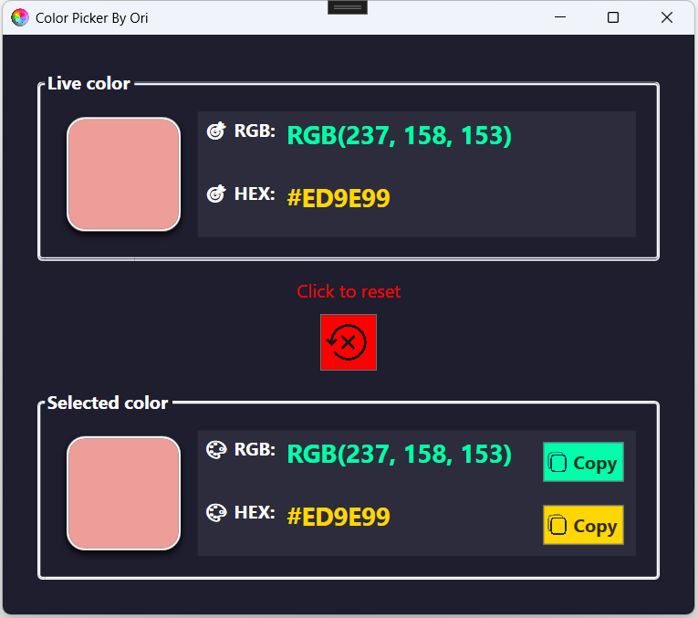

# ColorPickerLite 🎨

<div align="center">


**A simple and elegant tool for picking colors from your screen**

[](https://github.com/ori-halevi/ColorPickerLite)
[](https://prismlibrary.com/)
[](LICENSE)

</div>

---

## 📋 Description

ColorPickerLite is a lightweight and intuitive WPF application that allows you to pick colors from anywhere on your screen with ease. The application displays colors in real-time and enables quick copying of color codes in both RGB and HEX formats.

### ✨ Key Features

- 🖱️ **Real-time Selection** - See the color under your mouse cursor in real-time
- 🎯 **Click to Select** - Click to save the selected color
- 📋 **Quick Copy** - Copy RGB or HEX codes with a single click
- 🔄 **Simple Reset** - Reset your selection with a dedicated button
- 🎨 **Modern Interface** - Dark and elegant design with visual effects
- 🚀 **Lightweight** - Minimal resource consumption

---

## 🖼️ Screenshots



---

## 🚀 Quick Start

### System Requirements

- Windows 10/11
- .NET Framework 4.7.2 or higher (or .NET Core/NET 5+)

### Installation

1. Download the latest version from [Releases](https://github.com/ori-halevi/ColorPickerLite/releases)
2. Extract the files to a folder
3. Run `ColorPickerLite.exe`

### Usage

1. **Launch the application** - The app will start listening to mouse movements
2. **Move your mouse** - See the color under your cursor in the "Live color" window
3. **Click to select** - Left-click to select the color
4. **Copy the code** - Click "Copy" next to RGB or HEX for direct clipboard copy
5. **Reset** - Click the red button to reset the selection

---

## 🏗️ Project Structure

```
ColorPickerLite/
├── Views/
│   └── MainWindow.xaml          # Main user interface
├── ViewModels/
│   └── MainWindowViewModel.cs   # View logic
├── Services/
│   └── ColorPickerService/      # Color capture service
├── Converters/                  # XAML converters
├── Resources/                   # Images and icons
└── README.md
```

---

## 🛠️ Technologies

- **WPF (Windows Presentation Foundation)** - UI framework
- **Prism Library** - MVVM and Dependency Injection
- **Gma.System.MouseKeyHook** - Global mouse event listener
- **System.Drawing** - Screen pixel capture

---

## 🎯 Advanced Features

### Global Color Capture
The application uses Global Mouse Hooks to track the mouse across the entire screen, not just within the application window.

### Color Conversion
Support for two popular formats:
- **RGB** - `R: 255, G: 165, B: 0`
- **HEX** - `#FFA500`

### Easter Egg 🥚
Try right-clicking on the selected color... 😉

---

## 📝 Code Example

The color capture service:

```csharp
public class ColorPickerService : IColorPickerService
{
    private IKeyboardMouseEvents _hook;
    
    public event EventHandler<ColorPickedEventArgs> ColorPicked;

    public void StartListening()
    {
        _hook = Hook.GlobalEvents();
        _hook.MouseMove += OnMouseMove;
        _hook.MouseDownExt += OnMouseDown;
    }

    private Color GetColorAtPoint(Point location)
    {
        using (Bitmap screenshot = new Bitmap(1, 1))
        using (Graphics g = Graphics.FromImage(screenshot))
        {
            g.CopyFromScreen(location, Point.Empty, new Size(1, 1));
            return screenshot.GetPixel(0, 0);
        }
    }
}
```

---

## 🤝 Contributing

Contributions are always welcome!

1. Fork the project
2. Create a new branch (`git checkout -b feature/AmazingFeature`)
3. Commit your changes (`git commit -m 'Add some AmazingFeature'`)
4. Push to the branch (`git push origin feature/AmazingFeature`)
5. Open a Pull Request

---

## 📄 License

This project is distributed under the MIT License. See `LICENSE` for more details.

---

## 📧 Contact

Ori Halevi - [@Oh_tech](https://t.me/Oh_tech)

Project Link: [https://github.com/ori-halevi/ColorPickerLite](https://github.com/ori-halevi/ColorPickerLite)

---

## 🙏 Acknowledgments

- [Prism Library](https://prismlibrary.com/) - Excellent MVVM framework
- [MouseKeyHook](https://github.com/gmamaladze/globalmousekeyhook) - Global event listener library
- [SVG Repo](https://www.svgrepo.com/) - Free icons

---

<div align="center">

**Enjoying ColorPickerLite? Give us a ⭐ on GitHub!**

Made with ❤️ by Ori Halevi

</div>