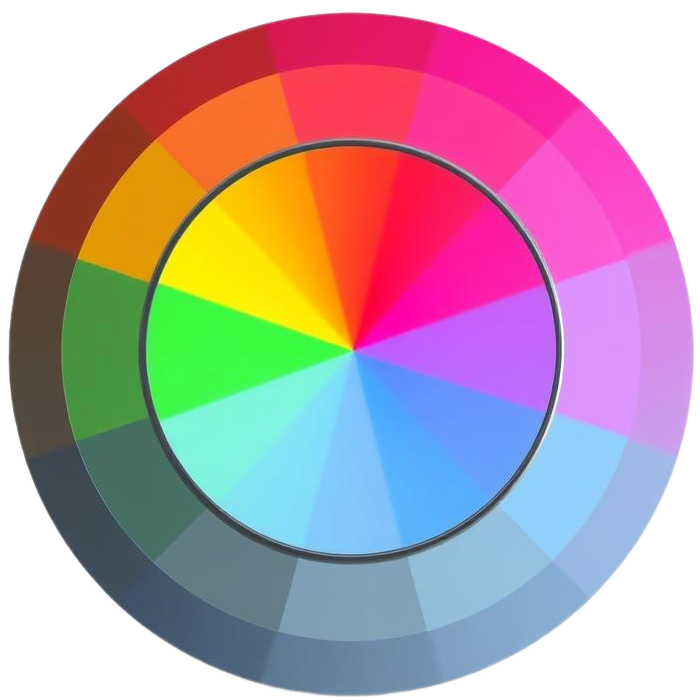

# ColorPickerLite 🎨

<div align="center">



**כלי פשוט ואלגנטי לבחירת צבעים מהמסך**

[](https://github.com/ori-halevi/ColorPickerLite)
[](https://prismlibrary.com/)
[](LICENSE)

</div>

---

## 📋 תיאור

ColorPickerLite הוא אפליקציית WPF קלת משקל ואינטואיטיבית המאפשרת לך לבחור צבעים מכל מקום על המסך בקלות. האפליקציה מציגה את הצבע בזמן אמת ומאפשרת העתקה מהירה של קודי צבע ב-RGB ו-HEX.

### ✨ תכונות עיקריות

- 🖱️ **בחירה בזמן אמת** - ראה את הצבע מתחת לעכבר בזמן אמת
- 🎯 **לחיצה לבחירה** - לחץ כדי לשמור את הצבע הנבחר
- 📋 **העתקה מהירה** - העתק קודי RGB או HEX בלחיצה אחת
- 🔄 **איפוס פשוט** - אפס את הבחירה בכפתור ייעודי
- 🎨 **ממשק מודרני** - עיצוב אפל ואלגנטי עם אפקטים ויזואליים
- 🚀 **קל משקל** - צריכת משאבים מינימלית

---

## 🖼️ צילומי מסך


---

## 🚀 התחלה מהירה

### דרישות מערכת

- Windows 10/11
- .NET Framework 4.7.2 ומעלה (או .NET Core/NET 5+)

### התקנה

1. הורד את הגרסה האחרונה מ[Releases](https://github.com/ori-halevi/ColorPickerLite/releases)
2. חלץ את הקבצים לתיקייה
3. הרץ את `ColorPickerLite.exe`

### שימוש

1. **הפעל את האפליקציה** - האפליקציה תתחיל להאזין לתנועות העכבר
2. **הזז את העכבר** - ראה את הצבע מתחת לעכבר בחלון "Live color"
3. **לחץ לבחירה** - לחץ עם כפתור שמאלי כדי לבחור את הצבע
4. **העתק את הקוד** - לחץ על "Copy" ליד RGB או HEX להעתקה ישירה ללוח
5. **איפוס** - לחץ על הכפתור האדום לאיפוס הבחירה

---

## 🏗️ מבנה הפרויקט

```
ColorPickerLite/
├── Views/
│   └── MainWindow.xaml          # ממשק המשתמש הראשי
├── ViewModels/
│   └── MainWindowViewModel.cs   # לוגיקת התצוגה
├── Services/
│   └── ColorPickerService/      # שירות לכידת צבעים
├── Converters/                  # ממירים ל-XAML
├── Resources/                   # תמונות ואייקונים
└── README.md
```

---

## 🛠️ טכנולוגיות

- **WPF (Windows Presentation Foundation)** - מסגרת UI
- **Prism Library** - MVVM ו-Dependency Injection
- **Gma.System.MouseKeyHook** - האזנה לאירועי עכבר גלובליים
- **System.Drawing** - לכידת פיקסלים מהמסך

---

## 🎯 תכונות מתקדמות

### לכידת צבעים גלובלית
האפליקציה משתמשת ב-Global Mouse Hooks כדי לעקוב אחר העכבר בכל רחבי המסך, לא רק בתוך חלון האפליקציה.

### המרת צבעים
תמיכה בשני פורמטים פופולריים:
- **RGB** - `R: 255, G: 165, B: 0`
- **HEX** - `#FFA500`

### Easter Egg 🥚
נסה ללחוץ לחיצה ימנית על הצבע הנבחר... 😉

---

## 📝 קוד לדוגמה

השירות לכידת צבעים:

```csharp
public class ColorPickerService : IColorPickerService
{
    private IKeyboardMouseEvents _hook;
    
    public event EventHandler<ColorPickedEventArgs> ColorPicked;

    public void StartListening()
    {
        _hook = Hook.GlobalEvents();
        _hook.MouseMove += OnMouseMove;
        _hook.MouseDownExt += OnMouseDown;
    }

    private Color GetColorAtPoint(Point location)
    {
        using (Bitmap screenshot = new Bitmap(1, 1))
        using (Graphics g = Graphics.FromImage(screenshot))
        {
            g.CopyFromScreen(location, Point.Empty, new Size(1, 1));
            return screenshot.GetPixel(0, 0);
        }
    }
}
```

---

## 🤝 תרומה לפרויקט

תרומות תמיד מתקבלות בברכה! 

1. Fork את הפרויקט
2. צור Branch חדש (`git checkout -b feature/AmazingFeature`)
3. Commit את השינויים (`git commit -m 'Add some AmazingFeature'`)
4. Push ל-Branch (`git push origin feature/AmazingFeature`)
5. פתח Pull Request

---

## 📄 רישיון

הפרויקט מופץ תחת רישיון MIT. ראה `LICENSE` לפרטים נוספים.

---

## 📧 יצירת קשר

שם שלך - [@yourhandle](https://twitter.com/yourhandle)

קישור לפרויקט: [https://github.com/ori-halevi/ColorPickerLite](https://github.com/ori-halevi/ColorPickerLite)

---

## 🙏 הוקרות

- [Prism Library](https://prismlibrary.com/) - מסגרת MVVM מצוינת
- [MouseKeyHook](https://github.com/gmamaladze/globalmousekeyhook) - ספריית האזנה לאירועים גלובליים
- [SVG Repo](https://www.svgrepo.com/) - אייקונים חינמיים

---

<div align="center">

**נהנית מ-ColorPickerLite? תן לנו ⭐ ב-GitHub!**

Made with ❤️ by [Your Name]

</div>